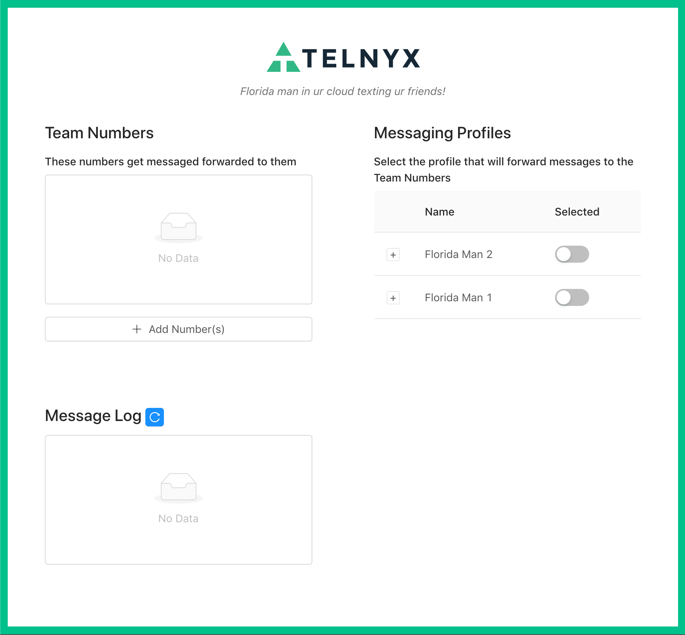

# Project Florida Man

This is a proof-of-concept application that uses the Telnyx SMS API to provide SMS-forwarding capabilities for any messaging-capable number on the Telnyx platform to one or more configured numbers.

## Limitations

The application currently has no authentication, so ***must not be used in production***. If the app is made accessible via a random address (e.g. ngrok subdomain), it should be OK to use this app for local testing and prototyping if supervised closely. Keep `DEBUG` off in the Django settings; turning it on may expose secrets like your API key in crash reports.

## Instructions

Prerequisite: [Python](https://www.python.org/downloads/) 3.7

1. Check out this repository.
1. Locally, build the virtual environment with `make venv` (requires [GNU Make 4](http://ftp.gnu.org/gnu/make/) or later, or use [`remake`](https://github.com/rocky/remake))
1. Complete the [Telnyx Setup Guide for Messaging](https://developers.telnyx.com/docs/v2/messaging/quickstarts/portal-setup). After this you should have a phone number and a messaging profile.
1. Get [ngrok](https://ngrok.com/) and start it pointing at a free port on your machine (Django's default is 8000) with `./ngrok http 8000`
1. Create a `.env` file from the template with: `cp .env.example .env` and fill in the values:
    * `TELNYX_API_KEY`: [A v2 API key](https://portal.telnyx.com/#/app/auth/v2), created in the Telnyx Portal
    * `TELNYX_WEBHOOK_PUBLIC_KEY`: [Your pre-assigned public key](https://portal.telnyx.com/#/app/account/public-key) from the Portal
    * `WEBHOOK_BASE_URL`: The http**s** ngrok forwarding address, e.g. `https://123abcde.ngrok.io`
1. Initialize the database with `./runner.sh manage migrate`
1. Start Django running with Python with `./runner.sh manage runserver 8000`. Verify that it's running by going to your public ngrok URL + `/smsfwd/messages/`. You should get an empty array back in the JSON response.

At this point you're all set up with the SMS-forwarding service. To run the client app:

1. Install [yarn](https://classic.yarnpkg.com/en/docs/install#mac-stable) >=1.17
1. Build client app: `cd client && yarn && yarn build && ..`
1. Copy client files for Django to serve: `./runner.sh manage collectstatic`
1. Visit your ngrok URL + `/index.html`. You should see the client UI
